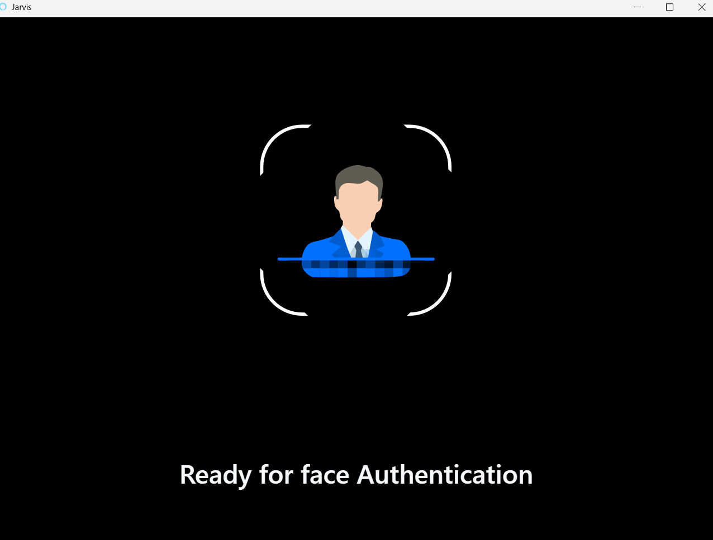
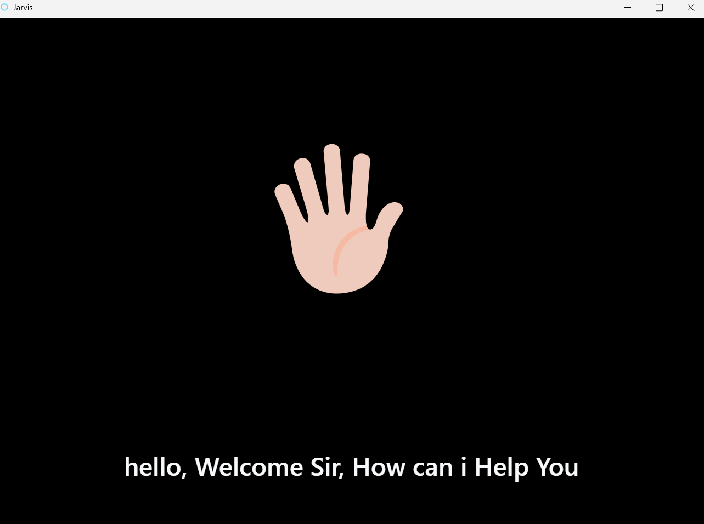
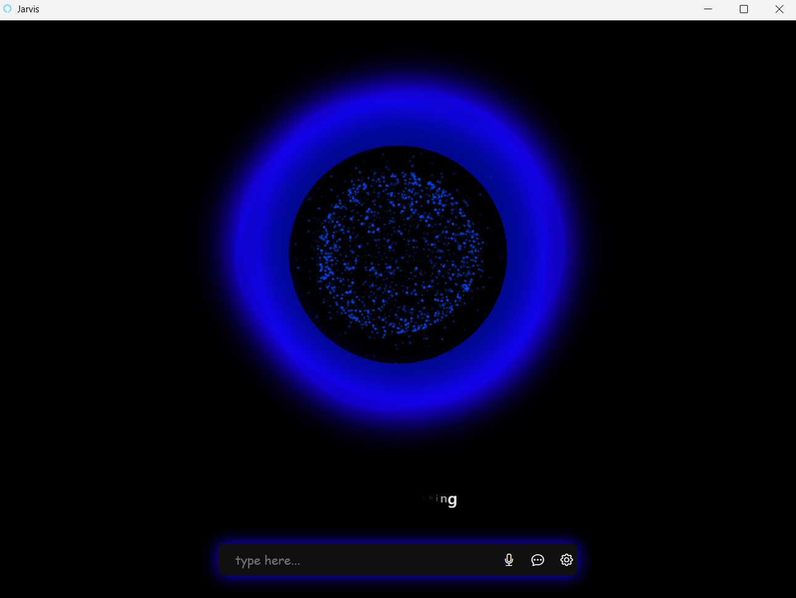
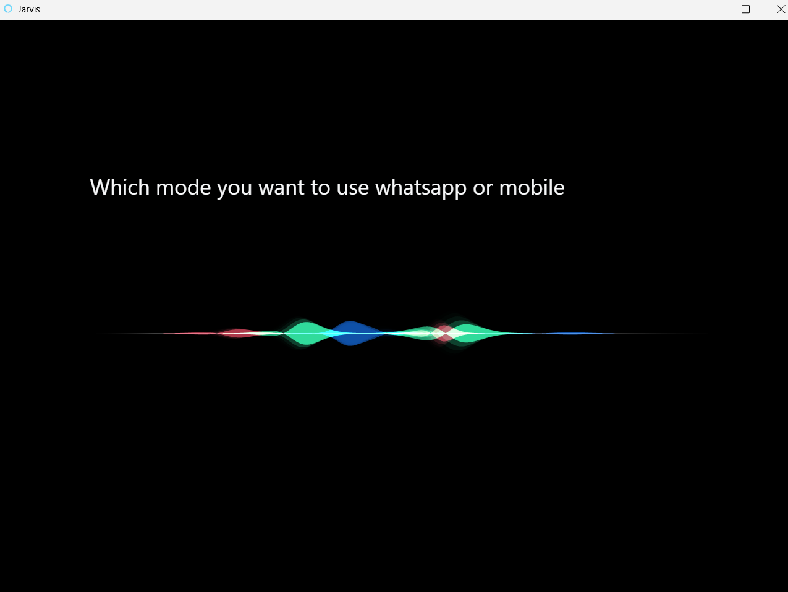

A fully functional AI-based Voice Assistant developed in Python that listens, understands, and executes voice commands – just like your own **J.A.R.V.I.S.**. This assistant can open apps, search Google/YouTube, send WhatsApp messages, and much more — all through **hands-free voice control**.

### 🚀 Key Features

#### 📞 Call & Message
- 📱 **Make Phone Calls** – `Phone call to AnyName`
- ✉️ **Send SMS Messages** – `Send message to AnyName`
- 🔊 **WhatsApp Audio/Video Calls** – `Audio call to AnyName on WhatsApp`
- 💬 **Send WhatsApp Messages** – `Send message to AnyName on WhatsApp`

#### 🌐 Smart Search
- 🔍 **Search on Google** – `Search IPL score on Google`
- 🎥 **Search on YouTube** – `Search Python tutorial on YouTube`

#### 📲 App Control
- 🌐 **Open Google App** – `Open Google`
- 📺 **Open YouTube App** – `Open YouTube`
- 🟢 **Open WhatsApp** – `Open WhatsApp`

#### ⚙️ Phone Controls
- 🔔 **Open Notification Panel** – `Open notification panel`
- 🔄 **Open Recent Apps** – `Open recent apps`

---

### ✅ Extra Highlights
- 🎤 Fully voice-controlled system
- 🤖 Hands-free Android automation
- 🗣️ Accurate speech recognition
- 🔄 Returns to idle (blob UI) automatically after command execution.

- ## 🔐 Face Authentication (Security Feature)

- 🔍 **Face Recognition Integration** – Jarvis **starts only after verifying your face**, ensuring **secure access**.  
- 🧠 Built using **OpenCV** and **face_recognition** Python libraries.  
- 🛡️ Prevents **unauthorized use** of the voice assistant.  
- ✅ Face is matched in **real-time** before activating any functionality.  
- 🎥 Captures face via **webcam** and compares with **pre-stored encoding**.

 ### Technology Used**

- 🟢 **Python**
- 🟢 **SpeechRecognition** – *to capture and recognize speech*
- 🟢 **pyttsx3 / gTTS** – *Text-to-speech*
- 🟢 **multiprocessing** – *Run Jarvis & hotword detection simultaneously*
- 🟢 **webbrowser / os** – *Open websites or desktop apps*
- 🟢 **ADB (Android Debug Bridge)** – *to control mobile via desktop commands*
- 🟢 **HTML, CSS, JavaScript, jQuery** – *Interactive desktop UI*
- 🟢 **Textillate.js** – *Desktop text animations*
- 🟢 **Lottie Animations** – to enhance UI with animated visuals*
- 🟢 **Url_launcher** – (to launch apps and web URLs on mobiles)*
- 🟢 **SiriWaveform** –(for voice UI waveform animation)*
- 🟢 **TextAnimator/WidgetAnimator** –( (for animated Jarvis texts)*
- 🟢 **SQlite** – *for database*
- 🟢 **and etc** .

## 🖼️ Output Screenshots
Here are some output screenshots of the AI Voice Assistant in action:
### 1.  🔐 Face Authentication Screen

### 2. UI - Oval

### 3. 🔊 Voice Command Detected

